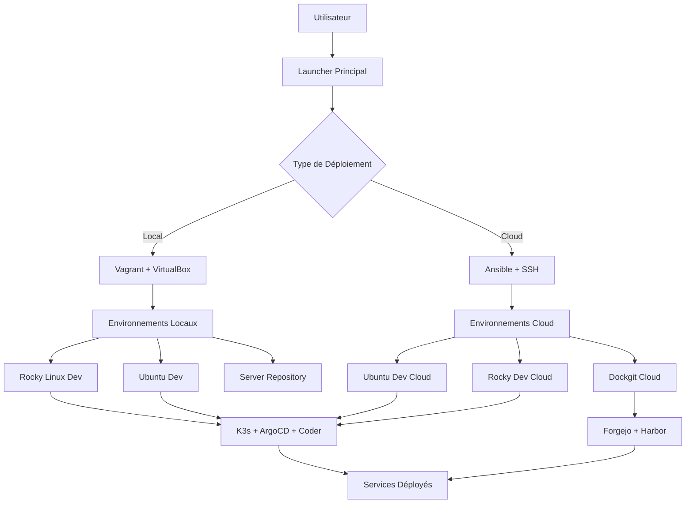

# 🚀 HIFADHI - Système de Provisionnement Automatisé

Un système complet de provisionnement d'environnements de développement et de production, combinant Terraform, Ansible, Vagrant et des scripts d'automatisation pour déployer rapidement des infrastructures cloud et locales.

## 📋 Table des Matières

- [🎯 Vue d'ensemble](#-vue-densemble)
- [🏗️ Architecture](#️-architecture)
- [🚀 Démarrage Rapide](#-démarrage-rapide)
- [📁 Structure du Projet](#-structure-du-projet)
- [🔧 Environnements Supportés](#-environnements-supportés)
- [⚙️ Installation et Configuration](#️-installation-et-configuration)
- [🎮 Utilisation](#-utilisation)
- [📚 Documentation Détaillée](#-documentation-détaillée)
- [🛠️ Développement et Personnalisation](#️-développement-et-personnalisation)
- [🐛 Dépannage](#-dépannage)
- [🤝 Contribution](#-contribution)

## 🎯 Vue d'ensemble

**HIFADHI** (qui signifie "sauvegarder" en swahili) est un système de provisionnement automatisé qui permet de déployer rapidement et facilement des environnements de développement et de production. Le système combine plusieurs technologies DevOps pour offrir une expérience unifiée et intuitive.

### ✨ Fonctionnalités Principales

- **🔄 Provisionnement Multi-Environnements** : Support pour Ubuntu, Rocky Linux et environnements spécialisés
- **☁️ Déploiement Cloud et Local** : Terraform pour le cloud, Vagrant pour le local
- **🤖 Automatisation Ansible** : Configuration et déploiement automatisés
- **🎮 Interface Interactive** : Menus clavier intuitifs et scripts en ligne de commande
- **🔐 Authentification Flexible** : Support des mots de passe et clés SSH
- **📊 Monitoring Intégré** : Surveillance des ressources et services
- **🛡️ Sécurité** : Configuration sécurisée par défaut

## 🏗️ Architecture



## 🚀 Démarrage Rapide

### 1️⃣ Installation des Outils

```bash
# Cloner le projet
git clone <votre-repo>
cd fileGitOps

# Lancer le script principal
chmod +x "launcher mac linux.sh"
./launcher\ mac\ linux.sh
```

### 2️⃣ Menu Principal

Le script principal offre un menu interactif avec les options suivantes :

1. **Installer les outils** - Installation automatique de Terraform, Ansible et Vagrant
2. **Lancer un provisionnement** - Déploiement d'environnements
3. **Supprimer un provisionnement** - Nettoyage des ressources
4. **Mise sous tension** - Démarrage des serveurs
5. **Mise hors tension** - Arrêt des serveurs
6. **Connexion** - Accès SSH aux serveurs
7. **Aide** - Documentation intégrée

### 3️⃣ Provisionnement Cloud

```bash
cd cloud
./launch.sh
```

## 📁 Structure du Projet

```
fileGitOps/
├── 📄 launcher mac linux.sh          # Script principal (interface unifiée)
├── 📄 laucncher windows.ps1          # Script Windows (PowerShell)
├── 📁 cloud/                         # Provisionnement cloud avec Ansible
│   ├── 📄 configure.sh               # Configuration cloud interactive
│   ├── 📄 launch.sh                  # Lanceur cloud
│   ├── 📄 README.md                  # Documentation cloud
│   ├── 📄 QUICKSTART.md              # Guide rapide cloud
│   ├── 📄 SUMMARY.md                 # Résumé des fonctionnalités
│   ├── 📄 config.yml                 # Configuration globale
│   ├── 📄 ansible.cfg                # Configuration Ansible
│   ├── 📁 ubuntu-dev/                # Environnement Ubuntu Dev
│   │   ├── 📁 ansible/
│   │   │   ├── 📄 playbook.yml       # Playbook Ansible Ubuntu
│   │   │   └── 📄 inventory.ini      # Inventaire généré
│   │   ├── 📁 scripts/
│   │   │   └── 📄 provision.sh       # Script de provisionnement
│   │   └── 📁 config/
│   │       └── 📄 example_inventory.ini
│   ├── 📁 rocky-dev/                 # Environnement Rocky Dev
│   │   └── [structure similaire]
│   └── 📁 dockgit/                   # Environnement Dockgit
│       └── [structure similaire]
├── 📁 testGitOps Rocky/              # Provisionnement local Rocky
│   ├── 📁 terraform/
│   │   └── 📄 main.tf                # Configuration Terraform
│   ├── 📁 scripts/
│   │   ├── 📄 creationlocal.sh       # Création environnement Vagrant
│   │   ├── 📄 provision_dev.sh       # Script de provisionnement
│   │   └── 📄 provision_test.sh      # Script de test
│   └── 📁 vagrant/                   # Dossier généré par Terraform
├── 📁 testGitOps Ubuntu/             # Provisionnement local Ubuntu
│   └── [structure similaire]
├── 📁 serveur_DOCKGIT/               # Serveur de repositories
│   └── [structure similaire]
└── 📁 podmantemplate/                # Template Coder avec Podman
    ├── 📄 main.tf                    # Configuration Coder
    └── 📄 README.md                  # Documentation Coder
```

## 🔧 Environnements Supportés

### 🖥️ Environnements Locaux (Vagrant + VirtualBox)

#### Rocky Linux Dev
- **OS** : Rocky Linux 9
- **Ressources** : 4GB RAM, 2 CPU
- **Services** : K3s, ArgoCD, Coder, Podman
- **Réseau** : 192.168.33.10

#### Ubuntu Dev
- **OS** : Ubuntu 22.04 LTS (Jammy)
- **Ressources** : 6GB RAM, 2 CPU
- **Services** : K3s, ArgoCD, Coder, Podman
- **Réseau** : 192.168.33.10

#### Server Repository
- **OS** : Rocky Linux 9
- **Ressources** : 4GB RAM, 2 CPU, 25GB disque
- **Services** : Forgejo, Harbor, Podman
- **Réseau** : 192.168.33.11

### ☁️ Environnements Cloud (Ansible + SSH)

#### Ubuntu Dev Cloud
- **Services** : K3s, ArgoCD, Coder, Podman
- **Authentification** : Mot de passe ou clé SSH
- **Ports** : 8090 (ArgoCD), 3000 (Coder)

#### Rocky Dev Cloud
- **Services** : K3s, ArgoCD, Coder, Podman
- **Authentification** : Mot de passe ou clé SSH
- **Ports** : 8090 (ArgoCD), 3000 (Coder)

#### Dockgit Cloud
- **Services** : Forgejo, Harbor, Podman
- **Authentification** : Mot de passe ou clé SSH
- **Ports** : 443 (Harbor), 3001 (Forgejo)

## ⚙️ Installation et Configuration

### Prérequis Système

#### macOS
```bash
# Installation via Homebrew (recommandé)
brew install terraform ansible hashicorp/tap/hashicorp-vagrant

# Ou installation manuelle
# Télécharger depuis les sites officiels
```

#### Linux (Ubuntu/Debian)
```bash
# Mise à jour des paquets
sudo apt-get update

# Installation d'Ansible
sudo apt install software-properties-common
sudo add-apt-repository --yes --update ppa:ansible/ansible
sudo apt install ansible

# Installation de Terraform
wget -O- https://apt.releases.hashicorp.com/gpg | gpg --dearmor | sudo tee /usr/share/keyrings/hashicorp-archive-keyring.gpg
echo "deb [arch=$(dpkg --print-architecture) signed-by=/usr/share/keyrings/hashicorp-archive-keyring.gpg] https://apt.releases.hashicorp.com $(lsb_release -cs) main" | sudo tee /etc/apt/sources.list.d/hashicorp.list
sudo apt update
sudo apt-get install terraform

# Installation de Vagrant
sudo apt install vagrant
```

#### Linux (CentOS/RHEL/Rocky)
```bash
# Installation d'Ansible
sudo dnf install epel-release
sudo dnf install ansible

# Installation de Terraform et Vagrant
sudo yum install -y yum-utils
sudo yum-config-manager --add-repo https://rpm.releases.hashicorp.com/RHEL/hashicorp.repo
sudo yum install -y terraform vagrant
```

### Configuration Initiale

1. **Cloner le projet** :
   ```bash
   git clone <votre-repo>
   cd fileGitOps
   ```

2. **Rendre les scripts exécutables** :
   ```bash
   chmod +x "launcher mac linux.sh"
   chmod +x cloud/*.sh
   chmod +x */scripts/*.sh
   ```

3. **Lancer l'installation automatique** :
   ```bash
   ./launcher\ mac\ linux.sh
   # Choisir "Installer les outils"
   ```

## 🎮 Utilisation

### Interface Principale

Le script principal (`launcher mac linux.sh`) offre une interface interactive avec navigation au clavier :

- **↑ ↓** : Navigation dans les menus
- **Entrée** : Validation de la sélection
- **q** : Quitter ou revenir

### Provisionnement Local

1. **Lancer le script principal** :
   ```bash
   ./launcher\ mac\ linux.sh
   ```

2. **Choisir "Lancer un provisionnement"**

3. **Sélectionner l'environnement** :
   - Rocky_DEV
   - Ubuntu_DEV
   - serverRepo

4. **Le système va** :
   - Créer le dossier `vagrant/`
   - Générer le `Vagrantfile`
   - Télécharger les images si nécessaire
   - Démarrer les machines virtuelles
   - Exécuter les scripts de provisionnement

### Provisionnement Cloud

1. **Accéder au dossier cloud** :
   ```bash
   cd cloud
   ```

2. **Lancer le provisionnement** :
   ```bash
   ./launch.sh
   ```

3. **Suivre les instructions** :
   - Choisir l'environnement
   - Saisir l'adresse IP
   - Saisir l'utilisateur
   - Choisir l'authentification (mot de passe ou clé SSH)

### Gestion des Serveurs

#### Démarrage
```bash
# Via le menu principal
./launcher\ mac\ linux.sh
# Choisir "mise sous tension"

# Ou directement
cd "testGitOps Rocky/vagrant"
vagrant up
```

#### Arrêt
```bash
# Via le menu principal
./launcher\ mac\ linux.sh
# Choisir "mise hors tension"

# Ou directement
cd "testGitOps Rocky/vagrant"
vagrant halt
```

#### Connexion SSH
```bash
# Via le menu principal
./launcher\ mac\ linux.sh
# Choisir "connexion"

# Ou directement
cd "testGitOps Rocky/vagrant"
vagrant ssh
```

### Accès aux Services

#### ArgoCD
- **URL** : `http://192.168.33.10:8090` (local) ou `http://VOTRE_IP:8090` (cloud)
- **Utilisateur** : `admin`
- **Mot de passe** : Affiché lors du provisionnement

#### Coder
- **Lancement** : `coder server` (sur le serveur)
- **URL** : `http://192.168.33.10:3000` (local) ou `http://VOTRE_IP:3000` (cloud)

#### Harbor (Dockgit)
- **URL** : `https://192.168.33.11` (local) ou `https://VOTRE_IP` (cloud)
- **Utilisateur** : `admin`
- **Mot de passe** : `Harbor12345`

#### Forgejo (Dockgit)
- **URL** : `http://192.168.33.11:3001` (local) ou `http://VOTRE_IP:3001` (cloud)

## 📚 Documentation Détaillée

### Script Principal (`launcher mac linux.sh`)

Le script principal est un orchestrateur complet qui gère :

- **Installation automatique** des outils requis
- **Détection intelligente** des environnements existants
- **Menus dynamiques** qui s'adaptent à l'état du système
- **Gestion des erreurs** avec messages informatifs
- **Interface cohérente** avec couleurs et navigation

#### Fonctionnalités Clés

1. **Vérification des prérequis** :
   - Détection de Vagrant, Ansible, Terraform
   - Installation automatique si manquant
   - Téléchargement des images Vagrant

2. **Gestion des environnements** :
   - Détection automatique des dossiers `vagrant/`
   - Statut des machines (running, stopped, not_provisioned)
   - Menus adaptatifs selon l'état

3. **Interface utilisateur** :
   - Navigation au clavier intuitive
   - Messages colorés et informatifs
   - Confirmation des actions destructives

### Système Cloud (`cloud/`)

Le système cloud utilise Ansible pour le provisionnement à distance :

#### Architecture Ansible

- **Playbooks** : Automatisation des tâches de configuration
- **Inventaires** : Générés dynamiquement selon les paramètres
- **Variables** : Configuration centralisée dans `config.yml`
- **Templates** : Réutilisables et personnalisables

#### Environnements Cloud

1. **Ubuntu Dev** :
   - Installation de K3s (Kubernetes léger)
   - Déploiement d'ArgoCD pour GitOps
   - Configuration de Coder pour les environnements de développement
   - Installation de Podman pour la gestion des conteneurs

2. **Rocky Dev** :
   - Même stack que Ubuntu Dev
   - Optimisé pour Rocky Linux 9
   - Configuration spécifique aux RPM

3. **Dockgit** :
   - Installation de Forgejo (Git self-hosted)
   - Déploiement de Harbor (registry de conteneurs)
   - Configuration SSL automatique
   - Base de données PostgreSQL

### Terraform

Les configurations Terraform sont minimales et utilisent des provisioners locaux :

```hcl
resource "null_resource" "creation_vagrant_env" {
  provisioner "local-exec" {
    command = "bash ../scripts/creationlocal.sh"
  }
}
```

Cette approche permet de :
- Générer les `Vagrantfile` dynamiquement
- Exécuter les scripts de provisionnement
- Maintenir la compatibilité avec Vagrant

### Scripts de Provisionnement

#### `creationlocal.sh`
- Création du dossier `vagrant/`
- Génération du `Vagrantfile` avec configuration réseau
- Lancement de `vagrant up`

#### `provision_dev.sh`
- Installation des outils de base
- Configuration de K3s
- Déploiement d'ArgoCD
- Configuration de Coder
- Installation de Podman

## 🛠️ Développement et Personnalisation

### Ajout d'un Nouvel Environnement

1. **Créer la structure** :
   ```bash
   mkdir -p "nouvel-environnement"/{terraform,scripts}
   ```

2. **Ajouter la configuration Terraform** :
   ```hcl
   # nouvel-environnement/terraform/main.tf
   resource "null_resource" "creation_vagrant_env" {
     provisioner "local-exec" {
       command = "bash ../scripts/creationlocal.sh"
     }
   }
   ```

3. **Créer le script de création** :
   ```bash
   # nouvel-environnement/scripts/creationlocal.sh
   # Copier et adapter depuis un environnement existant
   ```

4. **Modifier le script principal** :
   ```bash
   # Ajouter dans launcher mac linux.sh
   readonly NOUVEL_PATH="nouvel-environnement"
   ```

### Personnalisation des Playbooks Ansible

Les playbooks sont modulaires et facilement personnalisables :

```yaml
# cloud/ubuntu-dev/ansible/playbook.yml
- name: Install custom packages
  apt:
    name:
      - your-custom-package
    state: present
```

### Configuration des Variables

Modifier `cloud/config.yml` pour personnaliser :

```yaml
# Versions des logiciels
versions:
  k3s: "latest"
  argocd: "stable"
  coder: "latest"

# Ports
ports:
  argocd: 8090
  coder: 3000

# Mots de passe
passwords:
  harbor_admin: "VotreMotDePasse"
```

### Ajout de Services

Pour ajouter un nouveau service (ex: Prometheus) :

1. **Modifier le playbook** :
   ```yaml
   - name: Install Prometheus
     kubernetes:
       name: prometheus
       namespace: monitoring
       # ... configuration
   ```

2. **Ajouter les ports** dans `config.yml`

3. **Mettre à jour la documentation**

## 🐛 Dépannage

### Problèmes Courants

#### Erreur "Vagrant not found"
```bash
# Vérifier l'installation
which vagrant
vagrant --version

# Réinstaller si nécessaire
./launcher\ mac\ linux.sh
# Choisir "Installer les outils"
```

#### Erreur "VirtualBox not found"
```bash
# macOS
brew install --cask virtualbox

# Linux
sudo apt install virtualbox  # Ubuntu
sudo dnf install VirtualBox  # CentOS/RHEL
```

#### Problème de réseau
```bash
# Vérifier les ports utilisés
netstat -tulpn | grep :8080
netstat -tulpn | grep :8090

# Changer les ports dans le Vagrantfile si nécessaire
```

#### Erreur Ansible SSH
```bash
# Tester la connectivité
ssh -o StrictHostKeyChecking=no user@IP

# Vérifier les clés SSH
ssh-keygen -l -f ~/.ssh/id_rsa.pub
```

#### Problème de permissions
```bash
# Rendre les scripts exécutables
chmod +x *.sh
chmod +x */scripts/*.sh

# Vérifier les permissions SSH
chmod 600 ~/.ssh/id_rsa
chmod 644 ~/.ssh/id_rsa.pub
```

### Logs et Debug

#### Logs Vagrant
```bash
cd "testGitOps Rocky/vagrant"
vagrant up --debug
```

#### Logs Ansible
```bash
cd cloud/ubuntu-dev/ansible
ansible-playbook -i inventory.ini playbook.yml -vvv
```

#### Logs des Services
```bash
# Sur le serveur provisionné
sudo journalctl -u k3s
sudo journalctl -u argocd-server
```

### Nettoyage

#### Suppression complète
```bash
# Via le menu principal
./launcher\ mac\ linux.sh
# Choisir "Supprimer un provisionnement"

# Ou manuellement
cd "testGitOps Rocky/vagrant"
vagrant destroy -f
cd ..
rm -rf vagrant/
```

#### Nettoyage cloud
```bash
cd cloud
./cleanup.sh
```

## 🤝 Contribution

### Structure du Code

- **Scripts principaux** : Interface utilisateur et orchestration
- **Playbooks Ansible** : Automatisation des tâches
- **Configurations Terraform** : Infrastructure as Code
- **Documentation** : README et guides détaillés

### Standards de Code

- **Bash** : Utilisation de `set -e` et gestion d'erreurs
- **Ansible** : Playbooks idempotents et documentés
- **Terraform** : Configuration minimale et claire
- **Documentation** : Markdown avec exemples pratiques

### Tests

```bash
# Test de l'interface
./launcher\ mac\ linux.sh
# Naviguer dans tous les menus

# Test des playbooks
cd cloud/ubuntu-dev/ansible
ansible-playbook -i inventory.ini playbook.yml --check

# Test de connectivité
cd cloud
./test_connection.sh ubuntu-dev
```

### Pull Requests

1. **Fork** le projet
2. **Créer** une branche feature
3. **Tester** les modifications
4. **Documenter** les changements
5. **Soumettre** la pull request

---

## 📞 Support

Pour toute question ou problème :

1. **Consulter** cette documentation
2. **Vérifier** les logs d'erreur
3. **Tester** avec un environnement propre
4. **Créer** une issue sur le repository

---

**HIFADHI** - Votre solution de provisionnement automatisé ! 🚀
