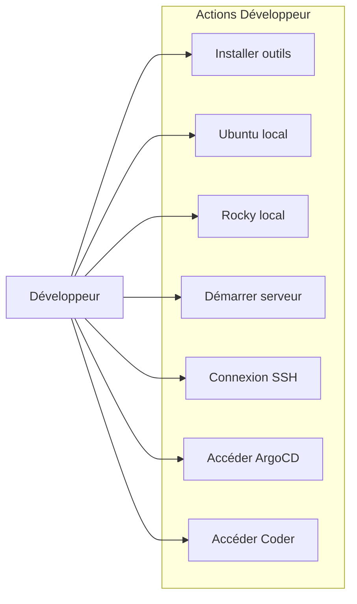
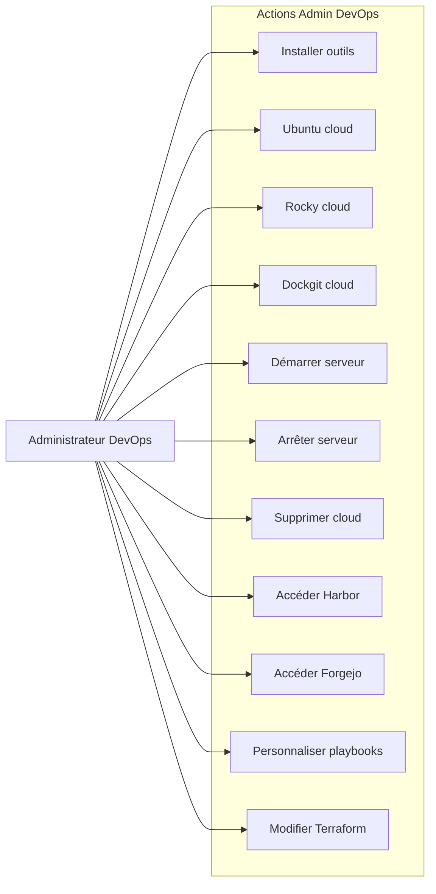

# Diagramme des Cas d'Utilisation UML - Système HIFADHI

## 🎯 Vue d'ensemble du Système

**HIFADHI** (Système de Provisionnement Automatisé) est un système complet qui permet de déployer rapidement des environnements de développement et de production en combinant Terraform, Ansible, Vagrant et des scripts d'automatisation.

## 👥 Acteurs Identifiés

### Acteurs Principaux
1. **Développeur** - Utilisateur principal qui utilise le système pour créer des environnements de développement
2. **Administrateur DevOps** - Gère les environnements de production, la maintenance et configure les pipelines d'automatisation

### Acteurs Secondaires
3. **Système Cloud** - Fournisseur d'infrastructure cloud (AWS, Azure, GCP)
4. **VirtualBox** - Hyperviseur pour les environnements locaux
5. **Services Externes** - K3s, ArgoCD, Coder, Harbor, Forgejo

## 📋 Cas d'Utilisation Principaux

### 🔧 Gestion des Outils et Prérequis
- **UC01** : Installer les outils DevOps (Terraform, Ansible, Vagrant)
- **UC02** : Vérifier les prérequis système
- **UC03** : Télécharger les images Vagrant

### 🚀 Provisionnement d'Environnements
- **UC04** : Provisionner un environnement Ubuntu Dev local
- **UC05** : Provisionner un environnement Rocky Dev local
- **UC06** : Provisionner un serveur de repositories local
- **UC07** : Provisionner un environnement Ubuntu Dev cloud
- **UC08** : Provisionner un environnement Rocky Dev cloud
- **UC09** : Provisionner un environnement Dockgit cloud

### ⚙️ Gestion des Serveurs
- **UC10** : Démarrer un serveur provisionné
- **UC11** : Arrêter un serveur en cours d'exécution
- **UC12** : Se connecter en SSH à un serveur
- **UC13** : Vérifier le statut d'un serveur

### 🗑️ Nettoyage et Maintenance
- **UC14** : Supprimer un provisionnement local
- **UC15** : Supprimer un provisionnement cloud
- **UC16** : Nettoyer les fichiers temporaires

### 📊 Monitoring et Accès aux Services
- **UC17** : Accéder à ArgoCD (GitOps)
- **UC18** : Accéder à Coder (Environnements de développement)
- **UC19** : Accéder à Harbor (Registry de conteneurs)
- **UC20** : Accéder à Forgejo (Git self-hosted)

### 🔐 Authentification et Sécurité
- **UC21** : S'authentifier avec un mot de passe SSH
- **UC22** : S'authentifier avec une clé SSH
- **UC23** : Configurer l'authentification sudo

### 🛠️ Configuration et Personnalisation
- **UC24** : Configurer les variables d'environnement
- **UC25** : Personnaliser les playbooks Ansible
- **UC26** : Modifier les configurations Terraform

## 📊 Diagramme des Cas d'Utilisation (Format Mermaid)

### Vue d'ensemble du Système

```mermaid
graph TB
    %% Acteurs principaux
    Dev[Développeur]
    AdminDevOps[Administrateur DevOps]
    
    %% Système HIFADHI
    HIFADHI[Système HIFADHI<br/>Provisionnement Automatisé]
    
    %% Groupes de cas d'utilisation
    subgraph "🔧 Gestion des Outils"
        UC01[UC01: Installer outils DevOps]
        UC02[UC02: Vérifier prérequis]
        UC03[UC03: Télécharger images Vagrant]
    end
    
    subgraph "🚀 Provisionnement Local"
        UC04[UC04: Ubuntu Dev local]
        UC05[UC05: Rocky Dev local]
        UC06[UC06: Serveur repos local]
    end
    
    subgraph "☁️ Provisionnement Cloud"
        UC07[UC07: Ubuntu Dev cloud]
        UC08[UC08: Rocky Dev cloud]
        UC09[UC09: Dockgit cloud]
    end
    
    subgraph "⚙️ Gestion Serveurs"
        UC10[UC10: Démarrer serveur]
        UC11[UC11: Arrêter serveur]
        UC12[UC12: Connexion SSH]
        UC13[UC13: Vérifier statut]
    end
    
    subgraph "🗑️ Nettoyage"
        UC14[UC14: Supprimer local]
        UC15[UC15: Supprimer cloud]
        UC16[UC16: Nettoyer fichiers]
    end
    
    subgraph "📊 Accès Services"
        UC17[UC17: ArgoCD]
        UC18[UC18: Coder]
        UC19[UC19: Harbor]
        UC20[UC20: Forgejo]
    end
    
    %% Relations principales
    Dev --> HIFADHI
    AdminDevOps --> HIFADHI
    
    %% Relations avec les groupes
    HIFADHI --> UC01
    HIFADHI --> UC04
    HIFADHI --> UC07
    HIFADHI --> UC10
    HIFADHI --> UC14
    HIFADHI --> UC17
```

### Diagramme Détaillé par Acteur

#### Développeur

#### Administrateur DevOps

## 🔄 Relations et Dépendances

### Relations d'Inclusion (Include)
- **UC01** inclut **UC02** (Vérifier les prérequis avant installation)
- **UC04, UC05, UC06** incluent **UC01** (Installer les outils avant provisionnement local)
- **UC07, UC08, UC09** incluent **UC01** (Installer les outils avant provisionnement cloud)
- **UC10** inclut **UC13** (Vérifier le statut avant démarrage)
- **UC11** inclut **UC13** (Vérifier le statut avant arrêt)
- **UC12** inclut **UC13** (Vérifier le statut avant connexion)

### Relations d'Extension (Extend)
- **UC21** étend **UC12** (Authentification par mot de passe pour SSH)
- **UC22** étend **UC12** (Authentification par clé SSH)
- **UC23** étend **UC21, UC22** (Configuration sudo pour l'authentification)

### Relations de Généralisation
- **UC04, UC05, UC06** sont des spécialisations de "Provisionnement Local"
- **UC07, UC08, UC09** sont des spécialisations de "Provisionnement Cloud"
- **UC17, UC18, UC19, UC20** sont des spécialisations de "Accès aux Services"

## 🎯 Scénarios d'Utilisation Principaux

### Scénario 1 : Développeur créant un environnement local
1. **UC01** : Installer les outils DevOps
2. **UC04** : Provisionner Ubuntu Dev local
3. **UC10** : Démarrer le serveur
4. **UC12** : Se connecter en SSH
5. **UC18** : Accéder à Coder

### Scénario 2 : Administrateur DevOps déployant en cloud
1. **UC01** : Installer les outils DevOps
2. **UC07** : Provisionner Ubuntu Dev cloud
3. **UC10** : Démarrer le serveur
4. **UC17** : Accéder à ArgoCD
5. **UC19** : Accéder à Harbor

### Scénario 3 : Administrateur DevOps configurant l'infrastructure
1. **UC25** : Personnaliser les playbooks Ansible
2. **UC26** : Modifier les configurations Terraform
3. **UC24** : Configurer les variables d'environnement
4. **UC09** : Provisionner Dockgit cloud

## 📈 Métriques et KPIs

- **Temps de provisionnement** : < 10 minutes pour un environnement local
- **Temps de déploiement cloud** : < 15 minutes
- **Disponibilité des services** : 99.9%
- **Temps de récupération** : < 5 minutes

## 🛡️ Contraintes et Limitations

- **Prérequis système** : macOS, Linux, Windows avec PowerShell
- **Ressources minimales** : 4GB RAM, 2 CPU pour environnements locaux
- **Connectivité** : Accès Internet requis pour téléchargements
- **Permissions** : Privilèges sudo requis pour installation

---

*Ce diagramme des cas d'utilisation UML représente l'architecture fonctionnelle complète du système HIFADHI, incluant tous les acteurs, cas d'utilisation, relations et scénarios identifiés lors de l'analyse du projet.*
